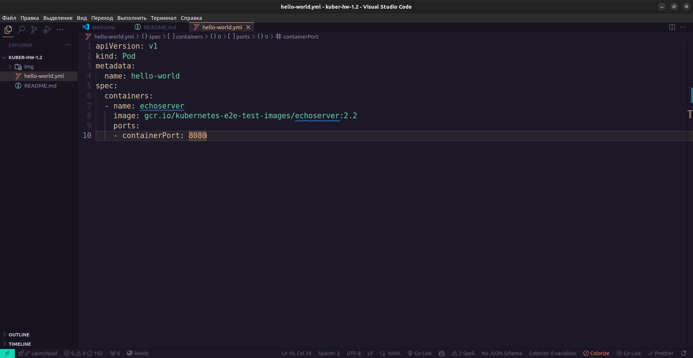
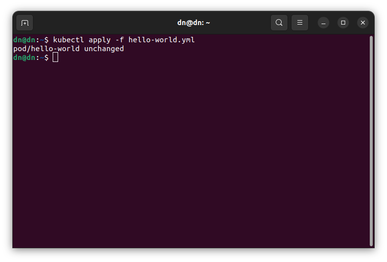
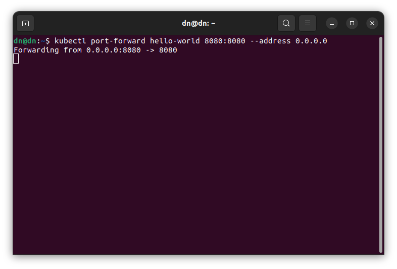
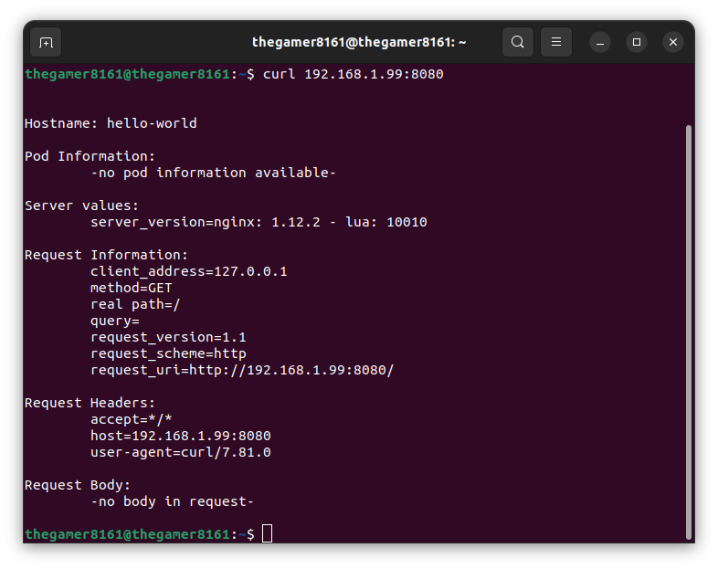
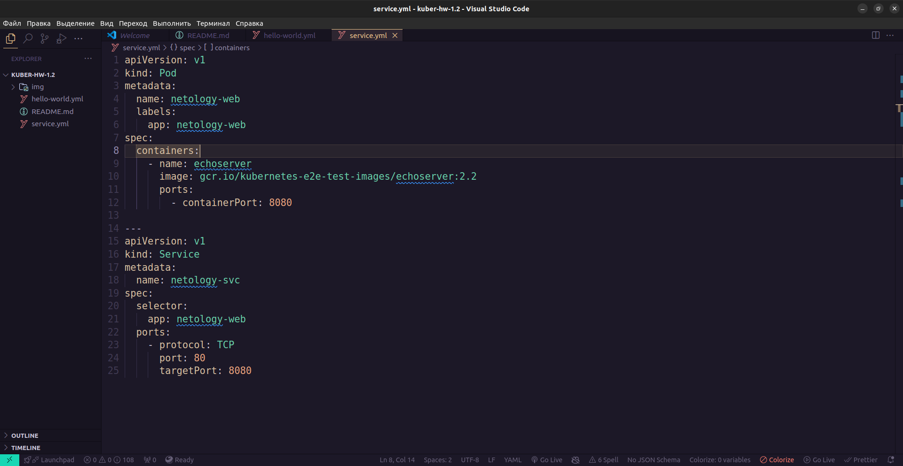
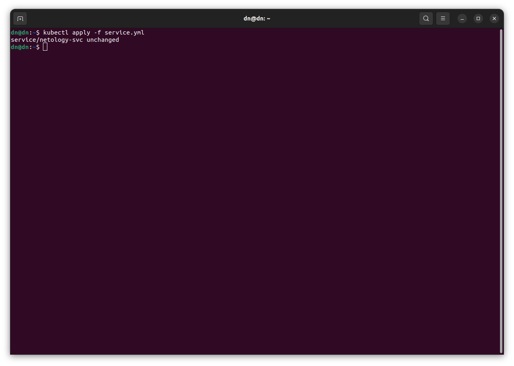
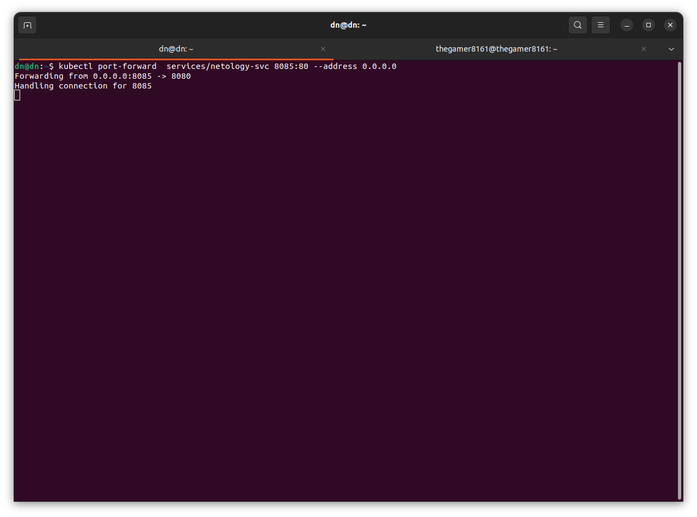
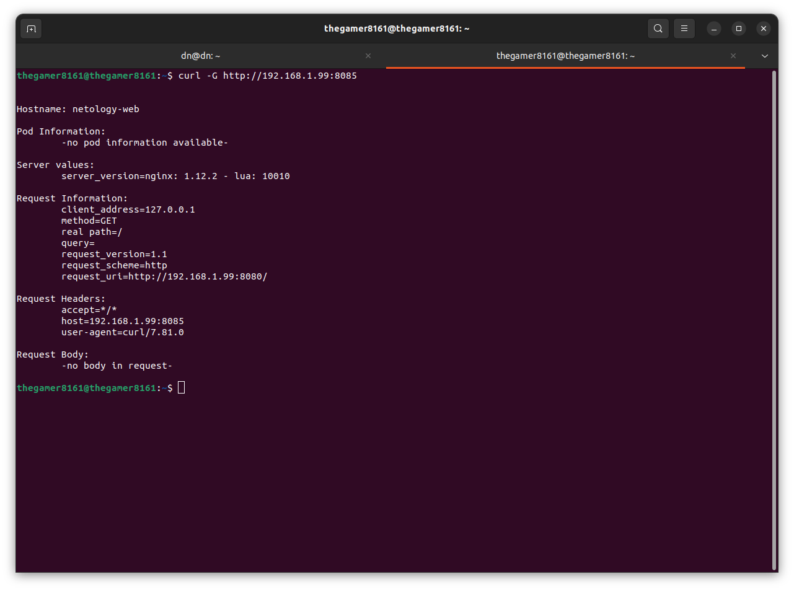

# Никоноров Денис - FOPS-8

# Домашнее задание к занятию «Базовые объекты K8S»

### Цель задания

В тестовой среде для работы с Kubernetes, установленной в предыдущем ДЗ, необходимо развернуть Pod с приложением и подключиться к нему со своего локального компьютера. 

### Задание 1. Создать Pod с именем hello-world

1. Создать манифест (yaml-конфигурацию) Pod.

2. Использовать image - gcr.io/kubernetes-e2e-test-images/echoserver:2.2.

Создан манифест [hello-world.yml](/hello-world.yml)

3. Подключиться локально к Pod с помощью `kubectl port-forward` и вывести значение (curl или в браузере).

С помощью curl проверен ответ от пода на GET-запрос

------

### Задание 2. Создать Service и подключить его к Pod

1. Создать Pod с именем netology-web.
2. Использовать image — gcr.io/kubernetes-e2e-test-images/echoserver:2.2.
3. Создать Service с именем netology-svc и подключить к netology-web.

Создан манифест [service.yml](/service.yml) объединён под с серивисом.

Запуск пода и сервиса 

Подключение к сервису с `kubectl port-forward`

4. Подключиться локально к Service с помощью `kubectl port-forward` и вывести значение (curl или в браузере).

------